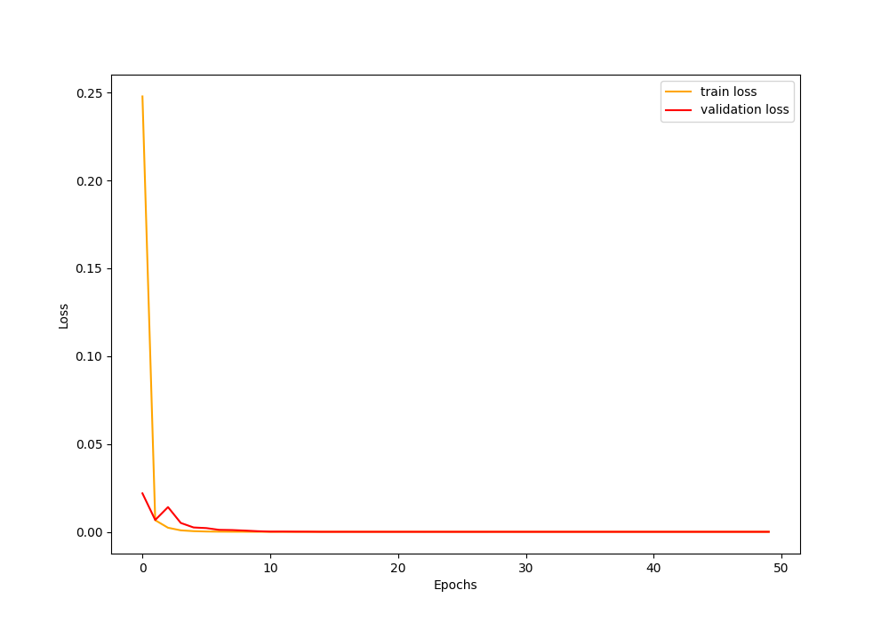

# Efficient-Runway-Feature-Extractor

# The model summary-
https://docs.google.com/document/d/10jcT93hoXBE1gSAWrxxYfq_8lg4wQ8Z-nmLr4R7b0uU/edit?tab=t.0

# Architecture

# links

https://pytorch.org/vision/stable/models/generated/torchvision.models.segmentation.lraspp_mobilenet_v3_large.html#torchvision.models.segmentation.LRASPP_MobileNet_V3_Large_Weights

# Architecture

# The training loss
